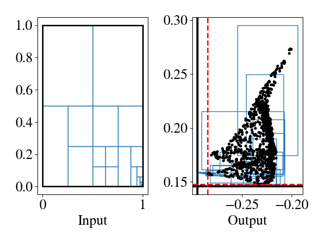
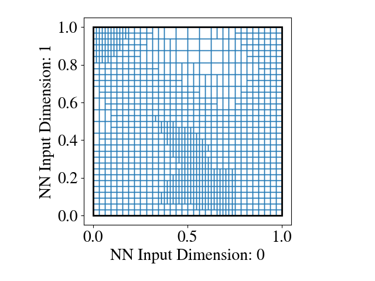
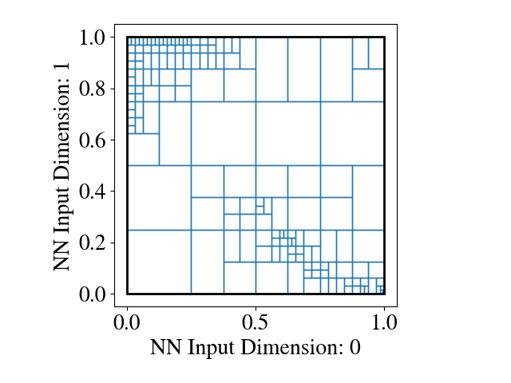
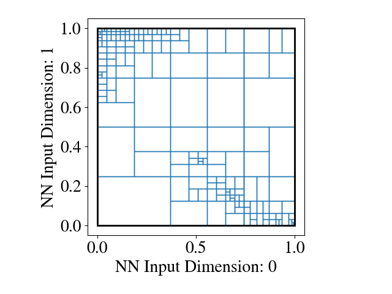
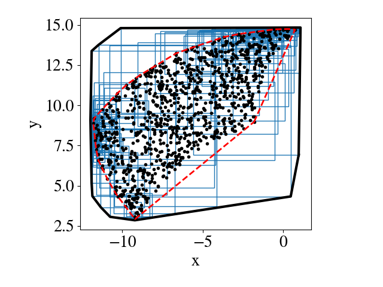

### About
This repository provides Analyzer, Propagator, and Partitioner classes from the LCSS/ACC '21 paper.
We import `auto_LIRPA`, `crown_ibp` and `robust_sdp` codebases from open source repositories (as Git submodules) and implement `Partitioner` methods from Xiang '17 and Xiang '20 in Python (open source implementation is in Matlab), along with our own methods from the paper.

### Get the code

```bash
git clone --recursive git@gitlab.com:mit-acl/ford_ugvs/robustness_analysis.git
```

### Install

In the root of this directory:
```bash
python -m pip install -e .
python -m pip install -e crown_ibp
python -m pip install -e partition
python -m pip install -e robust_sdp
python -m pip install -e auto_LIRPA
```

Now you can import things like:
```bash
>>> from reach_lp.reach_lp import reachLP_1
>>> import crown_ibp.bound_layers
```

TODOS:

- [x] Replicate Fig 4
- [x] Replicate Fig 5
- [x] Replicate Fig 6
- [ ] Replicate Fig 8
- [ ] Replicate Table 6b
- [ ] Replicate Table I
- [ ] get animation working
- [ ] Choices in analyzer argparse
- [ ] add rtdocs
- [x] move partitioners, propagators to separate dirs
- [ ] move cartpole, pend, quadrotor files elsewhere
- [ ] publish crown_ibp, auto-Lirpa forks
- [ ] move MNIST data to right place
- [ ] release version w/o closed_loop
- [ ] merge in closed_loop branch
- [ ] replicate those figs


## Reproduce Figures from LCSS/ACC 2021 Paper

### Figure 4

Figure 4a (Lower Bounds):
```bash
python -m partition.example \
	--partitioner GreedySimGuided \
	--propagator CROWN_LIRPA \
	--term_type time_budget \
	--term_val 2 \
	--interior_condition lower_bnds \
	--model random_weights \
	--activation relu \
	--show_input --show_output
```

Figure 4b (Linf Ball):
```bash
python -m partition.example \
	--partitioner GreedySimGuided \
	--propagator CROWN_LIRPA \
	--term_type time_budget \
	--term_val 2 \
	--interior_condition linf \
	--model random_weights \
	--activation relu \
	--show_input --show_output
```


Figure 4c (Convex Hull):
```bash
python -m partition.example \
	--partitioner GreedySimGuided \
	--propagator CROWN_LIRPA \
	--term_type time_budget \
	--term_val 2 \
	--interior_condition convex_hull \
	--model random_weights \
	--activation relu \
	--show_input --show_output
```

Fig 4a | Fig 4b | Fig 4c
------------ | ------------- | -------------
Lower Bounds | Linf Ball | Convex Hull
 |  | 

### Figure 5

Figure 5a (SG+IBP):
```bash
python -m partition.example \
	--partitioner SimGuided \
	--propagator IBP_LIRPA \
	--term_type time_budget \
	--term_val 2 \
	--interior_condition convex_hull \
	--model random_weights \
	--activation relu \
	--input_plot_labels None None \
	--show_input --skip_show_output \
	--input_plot_aspect equal
```

Figure 5b (SG+CROWN):
```bash
python -m partition.example \
	--partitioner SimGuided \
	--propagator CROWN_LIRPA \
	--term_type time_budget \
	--term_val 2 \
	--interior_condition convex_hull \
	--model random_weights \
	--activation relu \
	--input_plot_labels None None \
	--show_input --skip_show_output \
	--input_plot_aspect equal
```

Figure 5c (GSG+CROWN):
```bash
python -m partition.example \
	--partitioner GreedySimGuided \
	--propagator CROWN_LIRPA \
	--term_type time_budget \
	--term_val 2 \
	--interior_condition convex_hull \
	--model random_weights \
	--activation relu \
	--input_plot_labels None None \
	--show_input --skip_show_output \
	--input_plot_aspect equal
```

Figure 5d (GSG+CROWN):
```bash
python -m partition.example \
	--partitioner AdaptiveGreedySimGuided \
	--propagator CROWN_LIRPA \
	--term_type time_budget \
	--term_val 2 \
	--interior_condition convex_hull \
	--model random_weights \
	--activation relu \
	--input_plot_labels None None \
	--show_input --skip_show_output \
	--input_plot_aspect equal
```

Fig 5a | Fig 5b | Fig 5c | Fig 5d
------------ | ------------- | ------------- |  -------------
SG+IBP | SG+CROWN | GSG+IBP | GSG+CROWN
 |  |  | 


### Figure 6

Figure 6a (SG+IBP):
```bash
python -m partition.example \
	--partitioner SimGuided \
	--propagator IBP_LIRPA \
	--term_type time_budget \
	--term_val 2 \
	--interior_condition convex_hull \
	--model robot_arm \
	--activation tanh \
	--output_plot_labels x y \
	--output_plot_aspect equal \
	--skip_show_input
```

Figure 6b (AGSG+CROWN):
```bash
python -m partition.example \
	--partitioner AdaptiveGreedySimGuided \
	--propagator CROWN_LIRPA \
	--term_type time_budget \
	--term_val 2 \
	--interior_condition convex_hull \
	--model robot_arm \
	--activation tanh \
	--output_plot_labels x y \
	--output_plot_aspect equal \
	--skip_show_input
```

Fig 6a | Fig 6b |
------------ | -------------
SG+IBP | AGSG+CROWN
 | 

### Figure 7
This figure unfortunately requires code for the RL implementation that is under IP protection.

### Figure 8


---

### Figure 6
To reproduce this figure, please run:
```bash
python -m partition.experiments
```
This will iterate through combinations of `Partitioner`, `Propagator` and termination conditions and produce a timestamped `.pkl` file in `results` containing a `pandas` dataframe with the results.

To plot the data from this dataframe (it should happen automatically by running `experiments.py`), comment out `df = experiment()` in `experiments.py` and it will just load the latest dataframe and plot it.
You can switch which x axis to use with the argument of `plot()`.

---

## Older stuff

### Examples

See the implementation of Xiang 2017 and Xiang 2020:
```bash
python -m partition.xiang
```

This will pop up with:
- their randomly initialized DNN & 25 uniform partitioned inputs (from Xiang 2017)
- their robot arm example using CROWN & IBP and Uniform & Simulation-Guided partitioning (from Xiang 2020)


### tmp
```bash
source ~/code/gym-collision-avoidance/venv/bin/activate
```

### getting julia code to work

- Install julia via https://julialang.org/downloads
- Be sure to create a pointer to the executable (https://julialang.org/downloads/platform/)
```bash
# For OSX:
ln -s /Applications/Julia-<version>.app/Contents/Resources/julia/bin/julia /usr/local/bin/julia
```
- Install NeuralVerification.jl from Stanford's github
```bash
julia
# Press `]`
add https://github.com/sisl/NeuralVerification.jl
```
- Install pyjulia
```bash
python -m pip install julia
```
